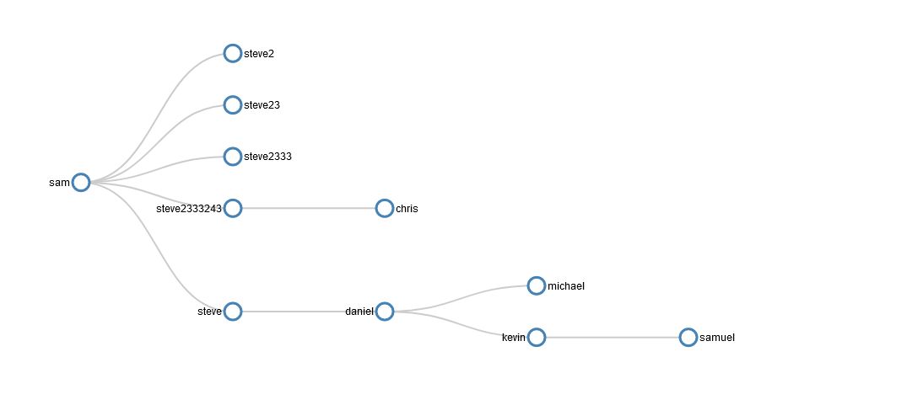

# Fallout Shelter Backend

Backend that stores vaultdwellers as well as keeps track of their familly heritage, age, whether they are deceased or not and various physical atributes

### `npm install`
to install dependancies

### `npm start`
to start server

a normal request normally travels from:
Routes(Endpoints) &#8594; Service(Business Logic) &#8594; Repo(Database Calls)

### Endpoints

### `/create`
post endpoint used to enter a new vault-dweller, must include some parameters in body
#### Required Parameters
`name: string`
`eye-color: string`
`hair-color: string`
`age: string | number`

#### Optional Parameters
`father: string`
`mother: string`

##### Example

```
{
    "name": "michael",
    "eye-color": "7",
    "hair-color": "brown",
    "age": 20,
    "father": "daniel",
    "mother": "molly"
}
```  

### `/vaultdweller/:name`
get endpoint that teturns the vault-dweller who has the same name as the one given

### `/query/:expression`
Basic query language

`*`  example: `name*steve`
binary operator denotes equality, can be used for (name)|(eye-color)|(hair-color)|(age)|(mother)|(father)

`_` example `mother_sa`
binary operator denotes substring, can be used for (name)|(eye-color)|(hair-color)|(age)|(mother)|(father)

`-)` example `steve-)` gives all of steves children, `-)steve` gives all of steves parents

Unary operator

### ```/passtime/:years```
get endpoint time passes by :years amount of years, all vault dwellers age that amount, and any above 70 will be flaggeed as deceased

### ```/decendants/:name```
get enpoint that returns a visual tree of all decendants of specified vault-dweller, spouses are not considered



If this was a paid service, clients would pay to use this backend with their front end being the game itself